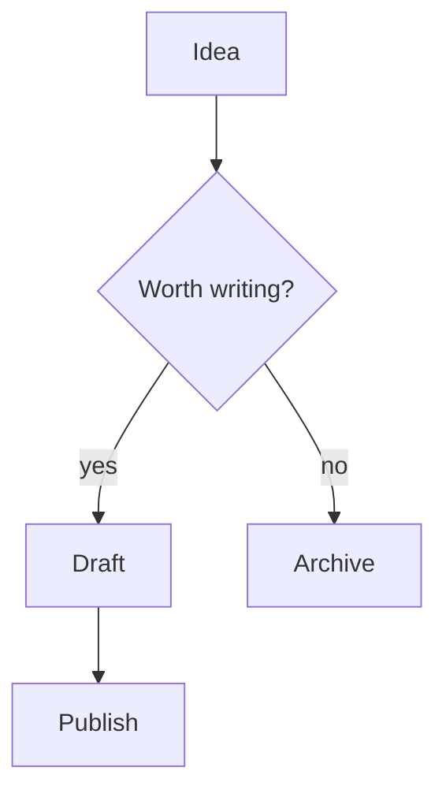

# Field Notes of a Markdown Tinkerer

This is a long document typed by hand, one key at a time. It exists to push every corner of the editor: headings, lists, tables, code, math, diagrams and all the small inline marks that make prose readable.

Some text is **bold**, some is _italic_, some is **_both at once_**, and some is ~~struck through~~. There is `inline code`, an escaped \*asterisk\*, and a [link to the CommonMark spec](https://spec.commonmark.org/0.31.2/).

Formatting by shortcut feels natural: this word is **important**, this one is _subtle_ and this is `code`.

You can also link a word like [Obsidian](https://obsidian.md) with one shortcut.

A line can end with two spaces  
to force a hard break, or with a backslash\
like this one.

Autolinks work too: <https://example.com> and plain https://writer.computer in running text.

## Headings of every size

### Third level

#### Fourth level

##### Fifth level

###### Sixth level

# Setext heading, level one

## Setext heading, level two

### Promoted by shortcut

## Lists

A shopping list, with nesting:

- Fruit
  - Apples
    - Granny Smith
    - Honeycrisp
  - Pears
- Vegetables
  - Carrots
- Bread

Paragraph after the list.

1. Preheat the oven
2. Mix the dry ingredients
3. Add the wet ingredients
   1. Eggs first
   2. Then the milk
4. Bake for 25 minutes

And a list that starts at seven:

7. Seventh
8. Eighth

### Tasks

- [ ] Write the introduction
- [x] Pick a title
- [ ] Review the tables
  - [ ] Check alignment
  - [x] Check wide content

- [ ] Converted with a shortcut

- Bulleted with a shortcut

A loose list with a second paragraph inside an item:

- First item has a long body that keeps going well past the edge of the column so that it wraps onto a second visual line in the editor.

  It also has a second paragraph, indented under the marker.

- Second item.

- Third item, but I want it first

## Quotes

> The best way to get a project done faster is to start sooner.
> It is a simple idea, and it is mostly right.
>
> > A nested quote, for good measure.
>
> - A list inside a quote
> - With two items

> [!note] Callout
> Obsidian-style callouts are just blockquotes with a marker.

## Code

```js
function greet(name) {
  const message = `Hello, ${name}!`;
  if (name.length > 10) {
    return message.toUpperCase();
  }
  return message;
}
```

```python
def fib(n: int) -> list[int]:
    a, b = 0, 1
    out = []
    for _ in range(n):
        out.append(a)
        a, b = b, a + b
    return out
```

```bash
# a very long shell line that should scroll horizontally instead of wrapping inside the code block
find . -name '*.md' -not -path './node_modules/*' -exec grep -l 'TODO' {} + | xargs wc -l | sort -n
```

An indented code block:

    plain indented code
    second line

## Tables

| Feature                                                | Status  |              Notes |
| :----------------------------------------------------- | :-----: | -----------------: |
| Headings                                               |  done   |         six levels |
| Tables                                                 | partial | alignment + `code` |
| Math                                                   |  done   |              KaTeX |
| A cell with **bold** and a [link](https://example.com) |   ok    |                 42 |

Text right after the table.

## Math

Inline math like $E = mc^2$ sits in a sentence, while prices like $5 and $10 stay as text.

$$
\int_0^\infty e^{-x^2} \, dx = \frac{\sqrt{\pi}}{2}
$$

A sum on one line: $$\sum_{k=1}^{n} k = \frac{n(n+1)}{2}$$

## Diagrams



## Raw HTML

<details>
<summary>Click to expand</summary>

Hidden content with **markdown** inside.

</details>

Press <kbd>Cmd</kbd> + <kbd>S</kbd> to save, and <mark>highlight</mark> what matters.

## Links, images and wiki links

A [reference link][spec] and another [one][gfm].

[spec]: https://spec.commonmark.org
[gfm]: https://github.github.com/gfm/


Wiki links: [[Daily Notes]], [[Projects/Writer#Roadmap|the roadmap]], and an embed ![[diagram.png]].

A footnote reference[^1] and a #tag in the text.

[^1]: The footnote text lives at the bottom.

## Odds and ends

Three kinds of horizontal rule:

---

---

---

Unicode and emoji: café, naïve, 東京, Ελληνικά, 🚀✨.

A very long unbroken token: https://example.com/a/really/long/path/that/never/ends/and/keeps/going/on/and/on/until/it/has/to/wrap/somewhere/index.html

Typing quickly with a mistake and fixing it: the quick brown fox jumps over the lazy dog.

Undo should remove only what I just typed.

The end.
